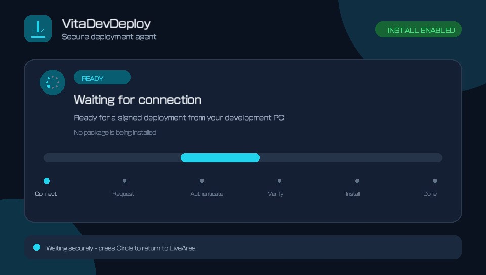
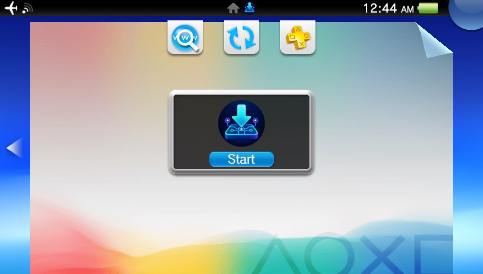

# VitaDevDeploy graphical UI lifecycle gate

Status: the opt-in native vita2d interface passed its supervised lifecycle gate
on a retail Vita running system software 3.65 on 2026-09-14. After the initial
checks and memory-card database update, it completed six consecutive
launch/exit cycles:
three SceShell peel closures and three Circle cleanup exits. None produced a GPU
fault or LiveArea hang. One earlier reported GPU fault did not recur and remains
recorded as an isolated observation. The headless agent remains the production
default while broader stress and firmware coverage accumulate.

## Artifact under test

- Agent title ID: `VDEVDEP01`
- Variant: install-enabled permanent agent with
  `VDEV_ENABLE_DISPLAY_UI=ON`
- EBOOT SHA-256:
  `0d5fc0db0eea70533c086b81a533170e7e2c4808066bbc2b122b67625f7e9250`
- VPK SHA-256:
  `1e2741abe14f9af5658208a707a394a65ef3799202187ae93908ae49cf3501bf`

The build helper verified all five LiveArea entries byte-for-byte against the
reviewed source tree before publishing the VPK. The installed `bg.png`,
`startup.png`, and `template.xml` were then read back over FTP and matched the
same local files.

## Observed result

The first launch reached the waiting state and rendered the complete 960x544
interface, including its readiness state, connection message, animated
activity indicator, deployment milestones, and idle-exit instruction:

A short Circle tap was intentionally not counted as a failure because the
idle loop samples input at 250 ms intervals. Holding Circle produced the normal
cleanup path and startup diagnostic stage 10 with result zero. The agent was
then launched a second time, reached startup stage 8 with result zero, and
again exited normally through Circle with stage 10 and result zero. SceShell
remained responsive across both launch/exit cycles.

Following the isolated report, three direct-launch/SceShell-peel-close cycles
and three direct-launch/Circle-cleanup cycles all completed normally. This
validates both the intended cleanup path and the ordinary user-facing SceShell
closure path on the tested configuration. Vita Companion's unauthenticated
`destroy` path was not part of this gate and should not be used on the display
build.

## LiveArea presentation follow-up

The custom bubble icon appeared, but SceShell initially continued to show its
generic background and gate after the in-place package update:

Because the installed artwork and template bytes matched the VPK, this was
classified as a SceShell presentation-cache refresh check rather than an asset
integrity or deployment failure. The normal system database update triggered
by removing and reinserting the memory card subsequently made the custom
background visible. This was a media/content rescan, not deletion and rebuild
of `app.db`. It confirms the asset package while remaining separate from the
in-app lifecycle gate.
